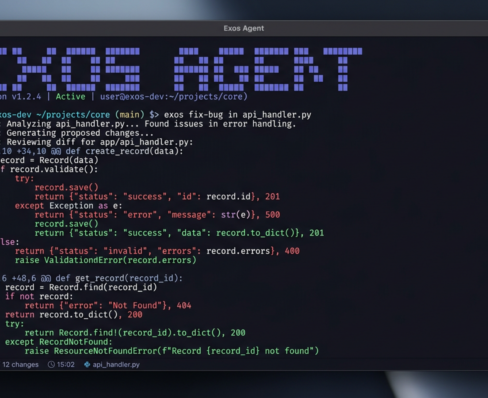

import { Tabs, TabItem } from "@astrojs/starlight/components"
import config from "../../../../config.mjs"
export const console = config.console

[**Exos Agent**](/) e un agente di programmazione AI open source. E disponibile come interfaccia per terminale, app desktop o estensione per IDE.



Iniziamo.

---

#### Prerequisiti

Per usare Exos Agent nel terminale, ti serve:

1. Un emulatore di terminale moderno, come:
   - [WezTerm](https://wezterm.org), cross-platform
   - [Alacritty](https://alacritty.org), cross-platform
   - [Ghostty](https://ghostty.org), Linux and macOS
   - [Kitty](https://sw.kovidgoyal.net/kitty/), Linux and macOS

2. Le chiavi API dei provider LLM che vuoi usare.

---

## Installa

Il modo piu semplice per installare Exos Agent e usare lo script di installazione.

```bash
curl -fsSL https://exos-agent.ai/install | bash
```

Puoi anche installarlo con i seguenti comandi:

- **Con Node.js**

        <Tabs>

      <TabItem label="npm">
      ```bash
      npm install -g exos-agent
      ```

          </TabItem>

        <TabItem label="Bun">
        ```bash
        bun install -g exos-agent
        ```

          </TabItem>

        <TabItem label="pnpm">
        ```bash
        pnpm install -g exos-agent
        ```

          </TabItem>

        <TabItem label="Yarn">
        ```bash
        yarn global add exos-agent
        ```

      </TabItem>

  </Tabs>

- **Con Homebrew su macOS e Linux**

  ```bash
  brew install anomalyco/tap/exos-agent
  ```

  > Ti consigliamo di usare il tap di Exos Agent per avere le release piu aggiornate. La formula ufficiale `brew install exos-agent` e mantenuta dal team Homebrew e viene aggiornata meno spesso.

- **Con Paru su Arch Linux**

  ```bash
  sudo pacman -S exos-agent           # Arch Linux (Stable)
  paru -S exos-agent-bin              # Arch Linux (Latest from AUR)
  ```

#### Windows

:::tip[Consigliato: usa WSL]
Per la migliore esperienza su Windows, ti consigliamo di usare [Windows Subsystem for Linux (WSL)](/docs/windows-wsl). Offre prestazioni migliori e piena compatibilita con le funzionalita di Exos Agent.
:::

- **Con Chocolatey**

  ```bash
  choco install exos-agent
  ```

- **Con Scoop**

  ```bash
  scoop install exos-agent
  ```

- **Con NPM**

  ```bash
  npm install -g exos-agent
  ```

- **Con Mise**

  ```bash
  mise use -g github:BlackXV2vip/agent-exos
  ```

- **Con Docker**

  ```bash
  docker run -it --rm ghcr.io/BlackXV2vip/agent-exos
  ```

Il supporto per installare Exos Agent su Windows usando Bun e attualmente in lavorazione.

Puoi anche scaricare il binario dalle [Releases](https://github.com/BlackXV2vip/agent-exos/releases).

---

## Configura

Con Exos Agent puoi usare qualsiasi provider LLM configurando le relative chiavi API.

Se e la prima volta che usi provider LLM, ti consigliamo [Exos Agent Zen](/docs/zen).
E una lista curata di modelli testati e verificati dal team di Exos Agent.

1. Esegui il comando `/connect` nella TUI, seleziona exos-agent e vai su [exos-agent.ai/auth](https://exos-agent.ai/auth).

   ```txt
   /connect
   ```

2. Accedi, aggiungi i dettagli di fatturazione e copia la tua chiave API.

3. Incolla la tua chiave API.

   ```txt
   ┌ API key
   │
   │
   └ enter
   ```

In alternativa, puoi selezionare uno degli altri provider. [Scopri di piu](/docs/providers#directory).

---

## Inizializza

Ora che hai configurato un provider, puoi spostarti in un progetto su cui vuoi lavorare.

```bash
cd /path/to/project
```

E avviare Exos Agent.

```bash
exos-agent
```

Poi inizializza Exos Agent per il progetto eseguendo il comando seguente.

```bash frame="none"
/init
```

Questo fara analizzare il progetto a Exos Agent e creera un file `AGENTS.md` nella root del progetto.

:::tip
Dovresti committare il file `AGENTS.md` del progetto su Git.
:::

Questo aiuta Exos Agent a capire la struttura del progetto e gli stili di codice usati.

---

## Utilizzo

Ora sei pronto a usare Exos Agent sul tuo progetto. Sentiti libero di chiedergli qualsiasi cosa!

Se e la prima volta che usi un agente di programmazione AI, ecco alcuni esempi che possono aiutare.

---

### Fai domande

Puoi chiedere a Exos Agent di spiegarti la codebase.

:::tip
Usa il tasto `@` per fare una ricerca fuzzy dei file nel progetto.
:::

```txt frame="none" "@packages/functions/src/api/index.ts"
How is authentication handled in @packages/functions/src/api/index.ts
```

Questo e utile se c'e una parte della codebase su cui non hai lavorato.

---

### Aggiungi funzionalità

Puoi chiedere a Exos Agent di aggiungere nuove funzionalita al progetto. Pero ti consigliamo prima di chiedergli di creare un piano.

1. **Crea un piano**

   Exos Agent ha una _Plan mode_ che disabilita la possibilita di fare modifiche e si limita a suggerire _come_ implementera la funzionalita.

   Passaci con il tasto **Tab**. Vedrai un indicatore nell'angolo in basso a destra.

   ```bash frame="none" title="Switch to Plan mode"
   <TAB>
   ```

   Ora descriviamo cosa vogliamo che faccia.

   ```txt frame="none"
   When a user deletes a note, we'd like to flag it as deleted in the database.
   Then create a screen that shows all the recently deleted notes.
   From this screen, the user can undelete a note or permanently delete it.
   ```

   Devi dare a Exos Agent abbastanza dettagli per capire cosa vuoi. Aiuta parlargli come se stessi parlando a uno sviluppatore junior del tuo team.

   :::tip
   Dai a Exos Agent molto contesto ed esempi per aiutarlo a capire cosa vuoi.
   :::

2. **Itera sul piano**

   Una volta che ti da un piano, puoi dargli feedback o aggiungere piu dettagli.

   ```txt frame="none"
   We'd like to design this new screen using a design I've used before.
   [Image #1] Take a look at this image and use it as a reference.
   ```

   :::tip
   Trascina e rilascia le immagini nel terminale per aggiungerle al prompt.
   :::

   Exos Agent puo analizzare le immagini che gli dai e aggiungerle al prompt. Puoi farlo trascinando e rilasciando un'immagine nel terminale.

3. **Implementa la funzionalita**

   Quando ti senti a tuo agio con il piano, torna in _Build mode_ premendo di nuovo il tasto **Tab**.

   ```bash frame="none"
   <TAB>
   ```

   E chiedigli di fare le modifiche.

   ```bash frame="none"
   Sounds good! Go ahead and make the changes.
   ```

---

### Apporta modifiche

Per modifiche piu semplici, puoi chiedere a Exos Agent di implementarle direttamente senza dover prima rivedere un piano.

```txt frame="none" "@packages/functions/src/settings.ts" "@packages/functions/src/notes.ts"
We need to add authentication to the /settings route. Take a look at how this is
handled in the /notes route in @packages/functions/src/notes.ts and implement
the same logic in @packages/functions/src/settings.ts
```

Assicurati di fornire abbastanza dettagli, cosi Exos Agent fa le modifiche giuste.

---

### Annulla modifiche

Mettiamo che tu chieda a Exos Agent di fare alcune modifiche.

```txt frame="none" "@packages/functions/src/api/index.ts"
Can you refactor the function in @packages/functions/src/api/index.ts?
```

Ma ti accorgi che non e quello che volevi. Puoi **annullare** le modifiche usando il comando `/undo`.

```bash frame="none"
/undo
```

Exos Agent ora ripristina le modifiche e mostra di nuovo il tuo messaggio originale.

```txt frame="none" "@packages/functions/src/api/index.ts"
Can you refactor the function in @packages/functions/src/api/index.ts?
```

Da qui puoi modificare il prompt e chiedere a Exos Agent di riprovare.

:::tip
Puoi eseguire `/undo` piu volte per annullare piu modifiche.
:::

Oppure puoi **rifare** le modifiche usando il comando `/redo`.

```bash frame="none"
/redo
```

---

## Condividi

Le conversazioni che fai con Exos Agent possono essere [condivise con il tuo team](/docs/share).

```bash frame="none"
/share
```

Questo creera un link alla conversazione corrente e lo copiera negli appunti.

:::note
Le conversazioni non vengono condivise per impostazione predefinita.
:::

Ecco un'[esempio di conversazione](https://exos-agent.ai/s/4XP1fce5) con Exos Agent.

---

## Personalizza

E tutto qui! Ora sei un pro nell'usare Exos Agent.

Per renderlo davvero tuo, ti consigliamo di [scegliere un tema](/docs/themes), [personalizzare i tasti rapidi](/docs/keybinds), [configurare i formatter](/docs/formatters), [creare comandi personalizzati](/docs/commands) o sperimentare con la [configurazione di Exos Agent](/docs/config).
