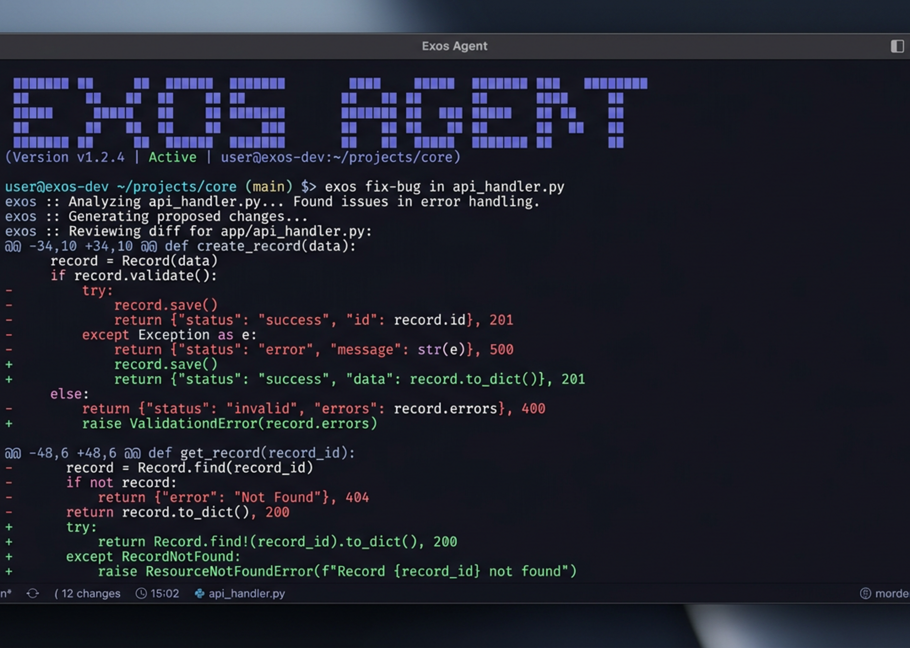

exos-agent, tarayıcınızda bir web uygulaması olarak çalışabilir ve bir terminale ihtiyaç duymadan aynı güçlü AI kodlama deneyimini sağlayabilir.



## Başlarken

Aşağıdakileri çalıştırarak web arayüzünü başlatın:

```bash
exos-agent web
```

Bu, `127.0.0.1` üzerinde rastgele kullanılabilir bir bağlantı noktasına sahip yerel bir sunucuyu başlatır ve exos-agent'u varsayılan tarayıcınızda otomatik olarak açar.

:::caution
`EXOS_AGENT_SERVER_PASSWORD` ayarlanmadıysa sunucunun güvenliği kaldırılacaktır. Bu, yerel kullanım için iyidir ancak ağ erişimi için ayarlanmalıdır.
:::

:::tip[Windows Kullanıcıları]
En iyi deneyim için PowerShell yerine `exos-agent web`'yi [WSL](/docs/windows-wsl)'den çalıştırın. Bu, uygun dosya sistemi erişimini ve terminal entegrasyonunu sağlar.
:::

---

## Yapılandırma

Web sunucusunu komut satırı bayraklarıyla veya [config dosyanızda](/docs/config) yapılandırabilirsiniz.

### Port

exos-agent varsayılan olarak kullanılabilir bir bağlantı noktasını seçer. Bir bağlantı noktası belirtebilirsiniz:

```bash
exos-agent web --port 4096
```

### Ana makine adı

Varsayılan olarak sunucu `127.0.0.1` (yalnızca localhost) öğesine bağlanır. exos-agent'u ağınızda erişilebilir kılmak için:

```bash
exos-agent web --hostname 0.0.0.0
```

`0.0.0.0` kullanıldığında, exos-agent hem yerel hem de ağ adreslerini gösterecektir:

```
  Local access:       http://localhost:4096
  Network access:     http://192.168.1.100:4096
```

### mDNS Keşfi

Sunucunuzun yerel ağda bulunabilir olmasını sağlamak için mDNS'yi etkinleştirin:

```bash
exos-agent web --mdns
```

Bu, ana bilgisayar adını otomatik olarak `0.0.0.0` olarak ayarlar ve sunucuyu `exos-agent.local` olarak tanıtır.

Aynı ağ üzerinde birden fazla örneği çalıştıracak şekilde mDNS alan adını özelleştirebilirsiniz:

```bash
exos-agent web --mdns --mdns-domain myproject.local
```

### CORS

CORS'a yönelik ek alan adlarına izin vermek için (özel ön uçlar için kullanışlıdır):

```bash
exos-agent web --cors https://example.com
```

### Kimlik Doğrulaması

Erişimi korumak için `EXOS_AGENT_SERVER_PASSWORD` ortam değişkenini kullanarak bir parola ayarlayın:

```bash
EXOS_AGENT_SERVER_PASSWORD=secret exos-agent web
```

Kullanıcı adı varsayılan olarak `exos-agent` şeklindedir ancak `EXOS_AGENT_SERVER_USERNAME` ile değiştirilebilir.

---

## Web Arayüzünü Kullanma

Web arayüzü başlatıldığında exos-agent oturumlarınıza erişim sağlar.

### Oturum

Oturumlarınızı ana sayfadan görüntüleyin ve yönetin. Aktif oturumları görebilir ve yenilerini başlatabilirsiniz.


### Sunucu Durumu

Bağlı sunucuları ve durumlarını görüntülemek için "Sunucuları Gör" seçeneğini tıklayın.


---

## Terminal Takma

Çalışan bir web sunucusuna bir terminal TUI'si ekleyebilirsiniz:

```bash
# Start the web server
exos-agent web --port 4096

# In another terminal, attach the TUI
exos-agent attach http://localhost:4096
```

Bu, aynı oturumları ve durumu paylaşarak hem web arayüzünü hem de terminali aynı anda kullanmanıza olanak tanır.

---

## Yapılandırma Dosyası

Sunucu ayarlarını `exos-agent.json` yapılandırma dosyanızda da yapılandırabilirsiniz:

```json
{
  "server": {
    "port": 4096,
    "hostname": "0.0.0.0",
    "mdns": true,
    "cors": ["https://example.com"]
  }
}
```

Komut satırı bayrakları yapılandırma dosyası ayarlarından önceliklidir.
